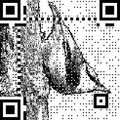

|  | I have an engineering degree in computer science from the [Military University of Technology in Warsaw](https://en.wikipedia.org/wiki/Military_University_of_Technology). I am currently pursuing a master's degree in artificial intelligence and machine learning at the [Łódź University of Technology](https://en.wikipedia.org/wiki/%C5%81%C3%B3d%C5%BA_University_of_Technology).|
| :---: | :--- |

<!--
**jakub-kowalik/jakub-kowalik** is a ✨ _special_ ✨ repository because its `README.md` (this file) appears on your GitHub profile.

Here are some ideas to get you started:

- 🔭 I’m currently working on ...
- 🌱 I’m currently learning ...
- 👯 I’m looking to collaborate on ...
- 🤔 I’m looking for help with ...
- 💬 Ask me about ...
- 📫 How to reach me: ...
- 😄 Pronouns: ...
- ⚡ Fun fact: ...
-->
